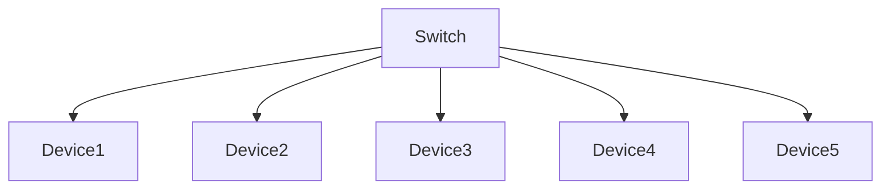
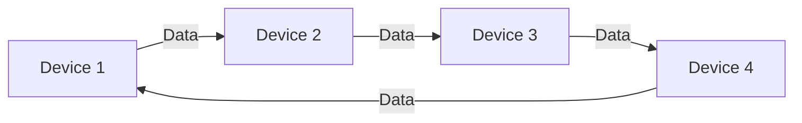
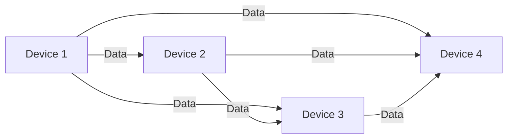
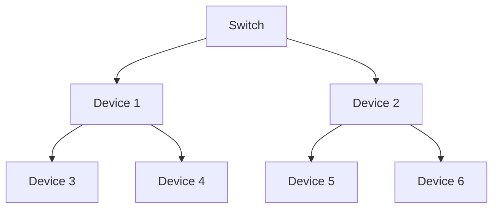
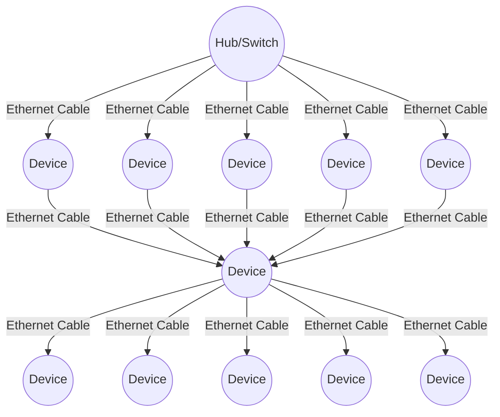

# Networking 101: Understanding the different Network Topologies

## Table of contents

- [Networking 101: Understanding the different Network Topologies.](#networking-101-understanding-the-different-network-topologies)
  - [Table of contents](#table-of-contents)
  - [Network Topologies](#network-topologies)
    - [Bus Topology](#1-bus-topology)
    - [Star Topology](#2-star-topology)
    - [Ring Topology](#3-ring-topology)
    - [Mesh Topology](#4-mesh-topology)
    - [Tree Topology](#5-tree-topology)
    - [Hybrid Topology](#6-hybrid-topology)
  - [Conclusion](#conclusion)

## Network Topologies

- A network topology refers to the physical or logical arrangement of devices in a computer network. It determines how devices are connected to each other and how data flows within the network.

### 1. Bus Topology

- In a bus topology, all devices are connected to a single communication medium, called a bus. Data is transmitted along the bus, and all devices receive the transmitted data. However, only the intended recipient processes the data. If one device fails, it does affect the rest of the network.

### 2. Star Topology

- In a star topology, all devices are connected to a central hub or switch. Data is transmitted between devices and the central hub or switch. If one device fails, it does not affect the rest of the network.

### 3. Ring Topology

- In a ring topology, devices are connected in a circular loop, where each device is connected to two neighboring devices. Data travels in a unidirectional manner around the ring. If one device fails, the entire network may be affected.

### 4. Mesh Topology

- In a mesh topology, every device is connected to every other device in the network. It provides redundancy and fault tolerance as multiple paths are available for data transmission. It is commonly used in large-scale networks like the internet.

### 5. Tree Topology

- In a tree topology, devices are arranged in a hierarchical structure resembling a tree. It combines characteristics of both star and bus topologies. It is commonly used in larger networks with multiple subnets. It supports future network expansion but can become unstable if the "root" node fails.

### 6. Hybrid Topology

- A hybrid topology combines two or more different topologies to meet specific network requirements. For example, a star-ring hybrid topology connects multiple star topologies using a ring topology

## Conclusion

These are just a few examples of commonly used network topologies. The choice of topology depends on factors such as network size, scalability, fault tolerance, and cost-effectiveness. Network administrators select the appropriate topology based on the specific needs of their organization.
