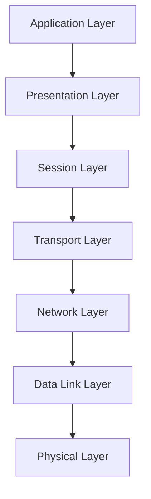

# Networking 101: Understanding the OSI Model

## Table of contents

- [Networking 101: Understanding the OSI Model](#networking-101-understanding-the-osi-model)
  - [Table of contents](#table-of-contents)
  - [OSI Model](#osi-model)
    - [Physical Layer](#1-physical-layer)
    - [Data Link Layer](#2-data-link-layer)
    - [Network Layer](#3-network-layer)
    - [Transport Layer](#4-transport-layer)
    - [Session Layer](#5-session-layer)
    - [Presentation Layer](#6-presentation-layer)
    - [Application Layer](#7-application-layer)
  - [Conclusion](#conclusion)

## OSI Model

The OSI (Open Systems Interconnection) model is a conceptual framework that standardizes the functions of a communication system into seven different layers. Each layer has a specific set of tasks and responsibilities, which collectively enable the seamless transfer of data from one device to another.

Here is an overview of the OSI Model:

### 1. Physical Layer

The Physical layer is responsible for the actual transmission and reception of raw bit streams over a physical medium, such as cables or wireless signals. It defines the hardware specifications and electrical connections required for data transmission.

### 2. Data Link Layer

The Data Link layer provides error-free communication between two directly connected nodes over a physical connection. It is responsible for framing data into frames, error detection and correction, and flow control.

### 3. Network Layer

The Network layer handles the routing of data packets from the source to the destination across multiple networks. It determines the optimal path for data transmission, performs logical addressing, and manages congestion control.

### 4. Transport Layer

The Transport layer ensures reliable and efficient data transfer between end systems. It segments data into smaller units, establishes end-to-end connections, and performs error recovery and flow control.

### 5. Session Layer

The Session layer establishes, manages, and terminates sessions between applications. It allows multiple applications to communicate and synchronize their actions.

### 6. Presentation Layer

The Presentation layer is responsible for data syntax and format conversion. It translates data into a standard format that the application layer can understand.

### 7. Application Layer

The Application layer provides a user interface for accessing network services. It enables applications to interact with the network and includes protocols like HTTP, FTP, SMTP, etc.

Below is a chart representing the OSI Model:

## Conclusion

Here is a table summarizing the functions of each layer:

| Layer             |Function                                                                   |
|-------------------|-------------------------------------------------------------------------- |
| Application       | Provides user interface and network services                              |
| Presentation      | Data format conversion and encryption/decryption                          |
| Session           | Establishes, manages, and terminates sessions                             |
| Transport         | Segments data, establishes connections, and ensures reliable transmission |
| Network           | Routes data packets across networks                                       |
| Data Link         | Provides error-free communication and framing                             |
| Physical          | Actual transmission and reception of bit streams                          |
