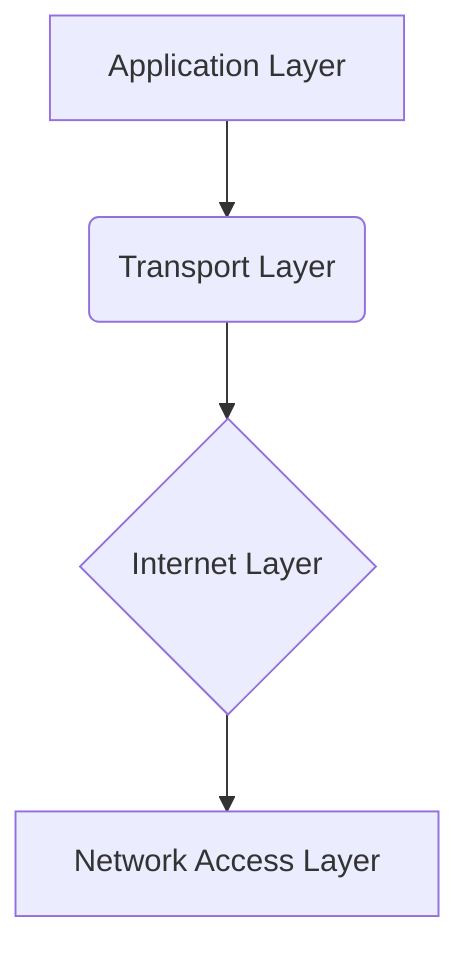

# Networking 101: Understanding the TCP/IP Model

## Table of contents

- [Networking 101: Understanding the TCP/IP Model](#networking-101-understanding-the-tcpip-model)
  - [Table of contents](#table-of-contents)
  - [TCP/IP Model](#tcpip-model)
    - [TCP/IP Model Chart](#tcpip-model-chart)
    - [TCP/IP Model Layers](#tcpip-model-layers)

## TCP/IP Model

The TCP/IP model is a networking protocol suite that defines the standards and rules for transmitting data over networks. It consists of four layers, each responsible for specific functions in the communication process. These layers are:

1. **Application Layer**: This layer is responsible for providing services directly to the user or application. It includes protocols such as HTTP, FTP, SMTP, and DNS. The application layer interacts with the end-user and provides a means for applications to communicate with each other.

2. **Transport Layer**: The transport layer ensures reliable and efficient data transfer between devices on a network. It is responsible for breaking data into smaller units, known as segments, and for reassembling them at the receiving end. The primary protocols of this layer are TCP (Transmission Control Protocol) and UDP (User Datagram Protocol).

3. **Internet Layer**: The internet layer is responsible for addressing, routing, and fragmenting data across different networks. It uses IP (Internet Protocol) to encapsulate data into packets, adds source and destination IP addresses, and determines the best path for data transmission. It also handles the fragmentation and reassembly of packets if necessary.

4. **Network Access Layer**: The network access layer, also known as the data link layer, is responsible for the physical transmission of data over the network. It includes protocols such as Ethernet, Wi-Fi, and PPP (Point-to-Point Protocol). This layer governs the interaction between the network hardware and the network itself.

### TCP/IP Model Chart

### TCP/IP Model Layers

| Layer               | Description                                                                                                   |
|---------------------|---------------------------------------------------------------------------------------------------------------|
| Application Layer   | Provides services directly to the user or application                                                         |
| Transport Layer     | Ensures reliable and efficient data transfer between devices                                                  |
| Internet Layer      | Handles addressing, routing, and fragmentation of data across different networks                              |
| Network Access Layer| Responsible for the physical transmission of data over the network                                            |
