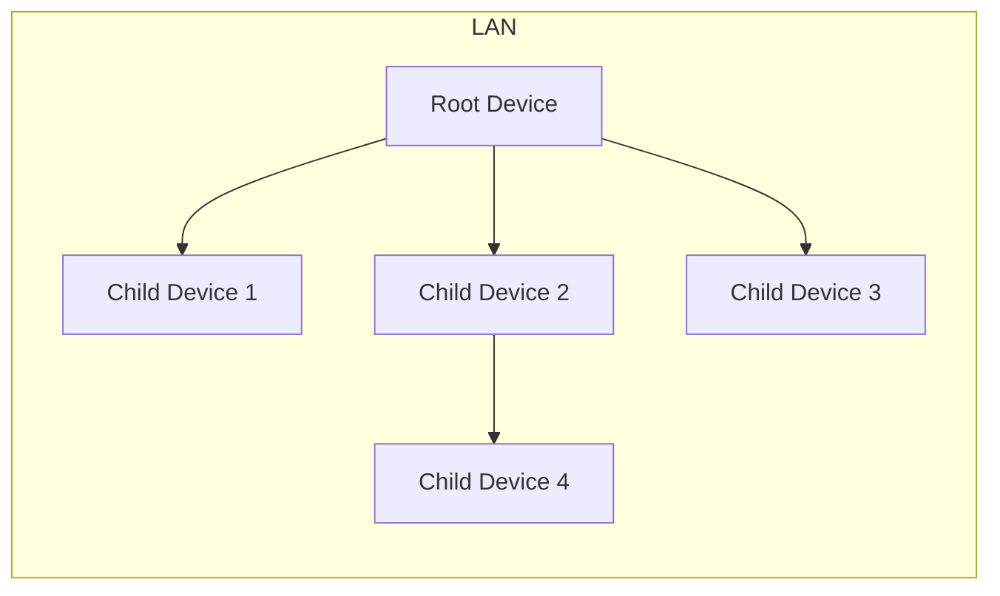
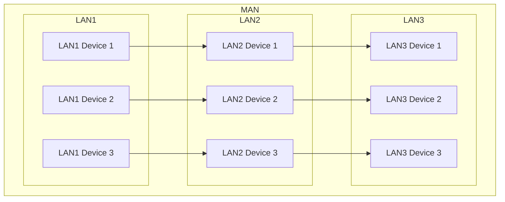
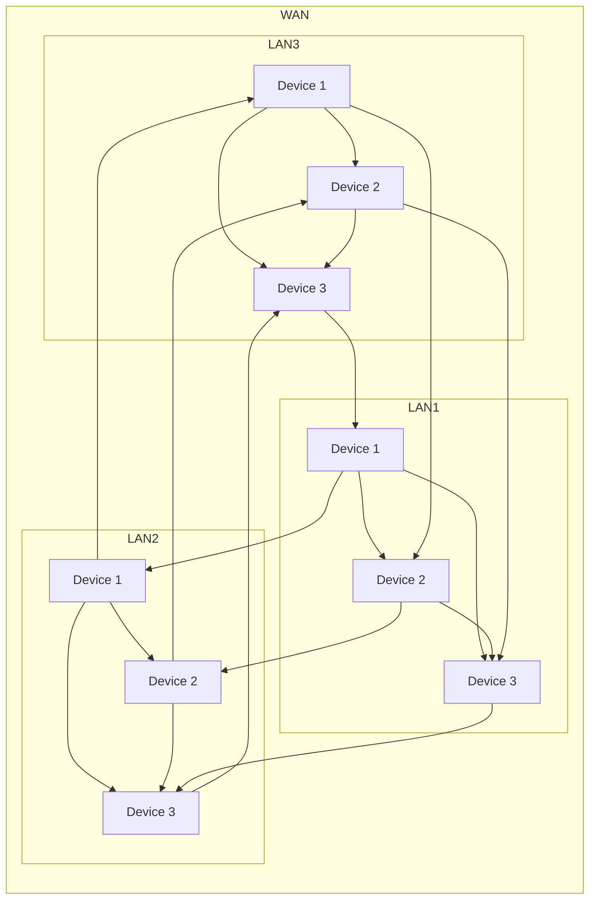

# Networking 101: Understanding the different Network Types

## Table of contents

- [Networking 101: Understanding the different Network Types](#networking-101-understanding-the-different-network-types)
  - [Table of contents](#table-of-contents)
  - [Network Types](#network-types)
    - [Network Types Chart](#network-types-chart)
    - [Network Types Summary](#network-types-summary)

## Network Types

In computer networking, there are different types of networks that serve various purposes. Each network type has its own characteristics, advantages, and use cases. Let's explore some common network types:

1. **Local Area Network (LAN)**: A LAN is a network that connects devices within a limited geographical area, such as a home, office, or school. LANs are typically used for sharing resources like printers, files, and internet connections among connected devices. They can be wired or wireless (in that case, a WLAN).

2. **Wide Area Network (WAN)**: A WAN is a network that spans a large geographical area, connecting multiple LANs **or** other networks together. It allows for communication between devices that are far apart, typically **using public or private communication links**. The internet itself is an example of a WAN.

3. **Metropolitan Area Network (MAN)**: A MAN is a network that covers a larger geographical area than a LAN but smaller than a WAN. It usually spans across a city or a metropolitan area. MANs are used to connect multiple LANs and provide high-speed connections for businesses, organizations, and educational institutions.

4. **Wireless Local Area Network (WLAN)**: A WLAN is a type of LAN that uses wireless communication technology, such as Wi-Fi, to connect devices. WLANs provide flexibility as devices can connect to the network without the need for physical cables. They are commonly used in homes, offices, cafes, and public spaces.

5. **Virtual Private Network (VPN)**: A VPN is a secure network connection that allows users to access a private network over a public network like the internet. It provides privacy, security, and anonymity by encrypting data and masking the user's IP address. VPNs are commonly used for remote access to corporate networks.

6. **Campus Area Network (CAN)**: A CAN is a network that connects multiple buildings or locations within a university campus or corporate campus. It provides high-speed connectivity and allows for efficient communication and resource sharing among different departments and facilities.

7. **Personal Area Network (PAN)**: A PAN is a network that connects devices in close proximity to an individual, typically within a range of a few meters. Examples include Bluetooth connections between devices or wireless connections between a smartphone and wearable devices.

### Network Types Chart

**Personnal Area Network**:

**Local Area Network**:

**Metropolitan Area Network**:

**Wide Area Network**:

### Network Types Summary

| Network Type                 | Description                                                                       |
|------------------------------|-----------------------------------------------------------------------------------|
| Local Area Network (LAN)     | Connects devices within a limited geographical area                               |
| Wide Area Network (WAN)      | Spans a large geographical area, connecting multiple LANs or networks             |
| Metropolitan Area Network (MAN) | Covers a larger geographical area than a LAN but smaller than a WAN            |
| Wireless Local Area Network (WLAN) | Uses wireless communication technology to connect devices                   |
| Virtual Private Network (VPN) | Provides secure network connections over a public network                        |
| Campus Area Network (CAN)    | Connects multiple buildings or locations within a campus                          |
| Personnal Area Newtork(PAN)  | Connects device in close proximity to an individual.
