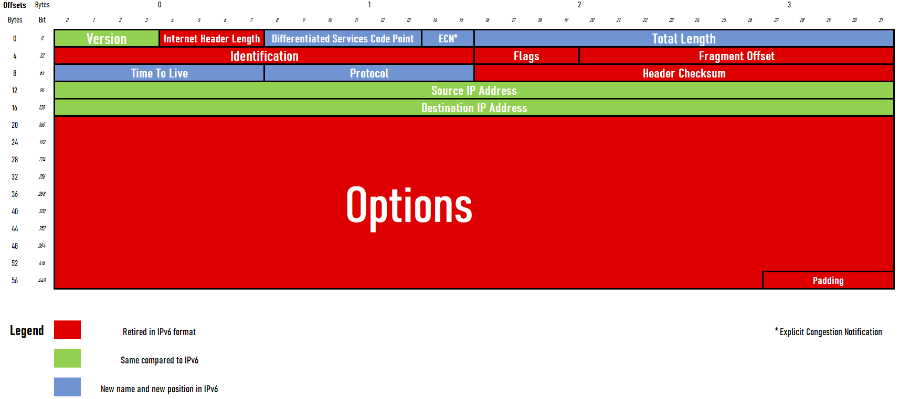
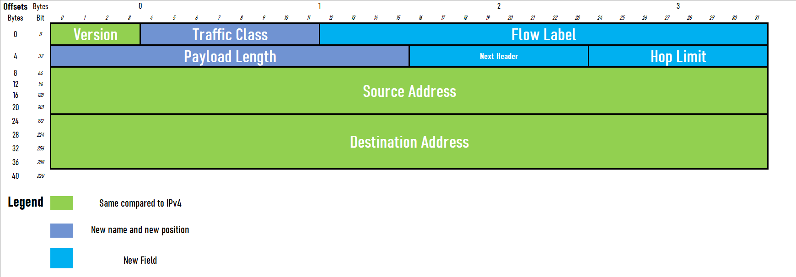

# Networking 101: Understanding IP addressing

<!-- TOC -->

- [Networking 101: Understanding IP addressing](#networking-101-understanding-ip-addressing)
    - [What is an IP Address?](#what-is-an-ip-address)
    - [IPv4 vs. IPv6](#ipv4-vs-ipv6)
        - [IPv4](#ipv4)
            - [Technical explanation](#technical-explanation)
            - [IPv4 Datagram](#ipv4-datagram)
        - [IPv6](#ipv6)
            - [IPv6 Datagram](#ipv6-datagram)
    - [Types of IP Addresses](#types-of-ip-addresses)
        - [Public IP Addresses](#public-ip-addresses)
        - [Private IP Addresses](#private-ip-addresses)
            - [IPv4 Private Networks](#ipv4-private-networks)
            - [IPv6 Private Networks](#ipv6-private-networks)
    - [Conclusion](#conclusion)
    - [References](#references)

<!-- /TOC -->

## What is an IP Address?

An IP address, short for Internet Protocol address, is a unique numerical label assigned to each device connected to a network. It acts as an identifier, allowing devices to send and receive data across the internet or a local network. Similar to how a phone number enables you to connect with someone, an IP address enables devices to communicate with each other.

## IPv4 vs. IPv6

There are two main versions of IP addresses: IPv4 (Internet Protocol version 4) and IPv6 (Internet Protocol version 6).

### IPv4

IPv4 is the older and more widely used version of IP addressing. It consists of four sets of numbers separated by periods, such as **192.168.0.1**. Each set can range from 0 to 255, providing a total of approximately 4.3 billion unique IP addresses.

#### Technical explanation

The IPv4 format is a 32-bit address expressed in decimal format, commonly known as dotted decimal notation. It consists of four sets of numbers separated by periods, with each set ranging from 0 to 255. Each set is called an octet, and it represents 8 bits of the address.

IPv4 addresses can also be expressed in hexadecimal notation, where each octet is represented by two hexadecimal digits. However, the more common format is the dotted decimal notation.

IPv4 addresses are hierarchical and consist of a network portion and a host portion. The network portion identifies the network to which the device belongs, while the host portion identifies the specific device within that network.

#### IPv4 Datagram

Here is the complete packet structure of IPv4.

### IPv6

To address the scarcity of IPv4 addresses, IPv6 was introduced. IPv6 utilizes a longer address format consisting of eight groups of four hexadecimal digits, separated by colons. An example of an IPv6 address is   `2001:0db8:85a3:0000:0000:8a2e:0370:7334`. With the vast number of unique addresses IPv6 provides (approximately 340 undecillion), it ensures the availability of addresses for the foreseeable future.

#### IPv6 Datagram

Here is the complete packet structure of IPv6.

## Types of IP Addresses

IP addresses can be categorized into two main types: public and private.

### Public IP Addresses

A public IP address is assigned by an Internet Service Provider (ISP) to a device that directly connects to the internet. It serves as the device's identity on the internet, allowing it to communicate with other devices globally. Websites, servers, and other internet-facing devices typically have public IP addresses.

### Private IP Addresses

On the other hand, private IP addresses are assigned to devices within a local network, such as your home or office network. These addresses are not directly accessible from the internet. Instead, a router or gateway device performs Network Address Translation (NAT), allowing private IP addresses to communicate with the internet using a single public IP address.

#### IPv4 Private Networks

| Network Range    | Subnet Mask    | Description                      |
|------------------|----------------|----------------------------------|
| 10.0.0.0/8       | 255.0.0.0      | Private network                  |
| 172.16.0.0/12    | 255.240.0.0    | Private network                  |
| 192.168.0.0/16   | 255.255.0.0    | Private network                  |

#### IPv6 Private Networks

| Network Range              | Subnet Mask                              | Description                      |
|----------------------------|------------------------------------------|----------------------------------|
| fc00::/7                   | fd00::/8                                 | Unique Local Unicast              |
| fe80::/10                  | fe80::/10                                | Link-Local Unicast                |

The concept of subnetting and CIDR will be covered in the next page.

## Conclusion

IP addressing is the backbone of modern networking, enabling devices to communicate and share information across the internet. Understanding the basics of IP addressing, including the different versions, types of addresses, and subnetting, provides a solid foundation for anyone interested in computer networks. So next time you browse the web or send an email, remember that IP addressing is silently working behind the scenes, connecting you to the vast digital world.

## References

For more technical details, please refer to the RFCs of the IP standards.

- [IPv6 RFC](https://datatracker.ietf.org/doc/html/rfc4291)
- [IPv4 RFC](https://datatracker.ietf.org/doc/html/rfc791)
